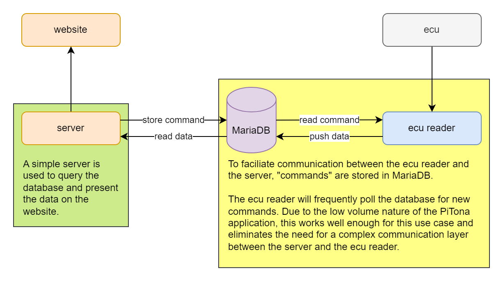

# PiTona

Welcome to the PiTona project! This project is an educational project to learn more about the
[OBD-II](https://en.wikipedia.org/wiki/On-board_diagnostics#OBD-II) protocol and the
[Raspberry Pi](https://www.raspberrypi.com/) microprocessor.

## Prerequisites
- Raspberry Pi with WiFi and USB connectivity.
- Pre 2013 Triumph Daytona 675 (these ECUs are not encrypted).

## Motivation
When I'm not writing code, I enjoy being out and about on my Triump Daytona 675.

Unfortunately, I recently saw the "check engine" light come on. Since I do not have access to any
OBD2 tools to read the ECU, I figured it'd be fun to write a little something myself. And thus, the
"PiTona" project was born!

I don't know how far I'm going to take this, but ultimately I'd like to at least be able to read my
bike's error code. Once I manage to do that, I'll see how far I can push it.

## Goals
The main purpose of this project is to see if it is possible to read OBD2 data from the onboard
ECU. However, simply logging data to a console is rather boring and too easy. To make things a
little more interesting, I'd like to build a website that shows you the real-time data of the
motorcycle (**please do not read this while you are riding!**).

If all goes well, I'd like to turn the application into a very neat tool to analyse my riding data.
It'd be awesome to have access to statistics such as lean angle, top speed, averge speed, GPS data,
and fuel efficiency!

## Technology stack
- [Raspberry Pi](https://www.raspberrypi.com/): hardware on which this whole thing runs
- [Rust](https://www.rust-lang.org/): programming language used to write the ecu reader
- [Node.js](https://nodejs.org/en): cross-platform JavaScript runtime environment used to run our website's server
- [Express](https://expressjs.com/): website's server framework for Node.js
- [Pug](https://pugjs.org/): template engine for Node.js
- [Bulma](https://bulma.io/): neat CSS framework to make everything look pretty
- [Chart.js](https://www.chartjs.org/): JavaScript charting library to display the motorcycle's data

## Supported PIDs
The list below contains all PIDs that have been confirmed to work on my 2008 Triumph Daytona 675.

### Service 01 - show current data
| PID (HEX) | Description                        | Comments |
| --------- | ---------------------------------- | -------- |
| 00        | List supported PIDs [0x01 to 0x20] |          |

## Architecture

## Help
> Services will not boot after updating the configuration files, even though the files are correct.

Check if your line endings are correct. The files should use `LF` line endings. If you save the
files using a Windows machine, chances are they are using `CRLF` line endings.

> I do not see the Raspberry Pi's network after rebooting.

Connect a keyboard and monitor to your Raspberry Pi to troubleshoot. The `journalctl` command might
come in handy to determine what exactly is failing.

> How can I SSH into my Raspberry Pi after installing PiTona?

PiTona is built to run in an isolated local network. Simply connect to your Raspberry Pi and SSH
into it using your favourite SSH agent. If you have used the default settings, try to SSH into
`pi@gw.wlan`.

> How can I change my DNS, AP, or other settings?

Either modify the configuration files in `/install_pitona` before you run the installation
script, or SSH into your Raspberry Pi and manually update the relevant configuration file(s).

## Disclaimer
Use this project at your own risk. There is a very real possibility that sending OBD2 commands,
without an understanding of what they do, will result in a broken ECU. This project is not
malicious in any way, shape, or form... however, I will not be held responsible for any damage,
issues, or other problems that might arise from the use of this software.

# Development log
## 2023
### 2023/04/23
- Started working on this project again
- Restructured architecture to avoid the pitfalls of the previous attempt
- Created architecture diagram

## 2022
### 2022/09/25
- Add file serving capability to webserver
- Add client React project boilerplate code
- Add build script to automatically create a [tarball](https://en.wikipedia.org/wiki/Tar_(computing))

### 2022/09/24
- Code clean-up
- Update README to include endpoint and PID documentation
- Add debug endpoint to send arbitrary data to the ECU

### 2022/09/10
- Discovered that the `3033` "DTC" is not really a fault code. Instead, this response is most
  likely the start of a ISO-TP frame. Parsing this data is relatively difficult, which is why I
  will work on it once the application is a bit more mature.

### 2022/09/05
- Major refactor of the codebase
- New structure makes it easier to add new functionality

### 2022/09/04 🏆
- Implemented simple serial communication logic
- Implemented endpoints to communicate with the server
- Managed to send commands to the ECU
  - `0100` returns `30313030`, which indicates the PIDs supported by this ECU
  - `03` returns `3033`, which refers to a status code, but I have not been able to decode it yet

### 2022/09/02
- Switched from Kotlin / Spring Boot to Go

### 2022/08/28
- Switched from C# / .NET to Kotlin / Spring Boot

### 2022/08/21
- Add circular buffer implementation
- Add unit tests

### 2022/08/20
- Add serial port reading logic

### 2022/08/16
- Project set-up
- Simple .NET server
- Tried to turn the Raspberry Pi into a local access point
